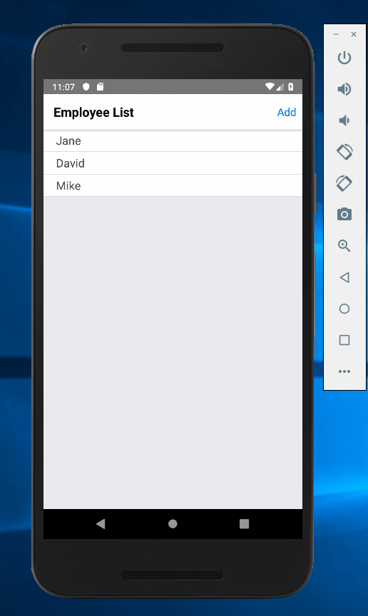

## React Native and Redux Manager Application
This is a simple mobile application made with React Native and Redux. It is meant to simulate the functions performed by a manager in so far as it requires authentication, allows the user to add employees/shifts, remove employees, make a schedule, and send text message updates to employees from within the application. 

## Motivation
This project was made to sharpen my skills in React Native and learn how to use Redux. Given the popularity of the mobile platform, and the ubiquity of Redux, I thought comitting to a project using these technologies would be highly beneficial. 

 
## Screenshots

## Tech/framework used

<b>Built with</b>
- [React](https://reactjs.org/)
- [React Native](https://facebook.github.io/react-native/)
- [Redux](https://nodejs.org/en/)
- [Node](https://redux.js.org/)
- [Firebase](https://firebase.google.com/?gclid=CjwKCAiAu_LgBRBdEiwAkovNsHlQPY70DcCREV4VL-Xfnr8vQUxI0JF5d5atsvVEJeYzVIkW43-iBBoCumMQAvD_BwE)

## Features
The aspects of this application that make it unique are twofold. Firstly, it uses modern technologies that are currently being used in production. This gives the application a contemporary status which allows it to parallel other ismilar applications on the market. Secondly, the functionality of the application are practical; many comapanies likely use similar systems for organizing their scheduling. 

## Installation and Usage?
So if all you desire is looking into the source code, than you are in the right place. This app is in a public repository that can be accessed by anyone with a GitHub account. 

Running this application is alightly more challnging. [This Article](https://codeburst.io/setting-up-development-environment-using-react-native-on-windows-dd240e69f776) provides a more thorough guide to setting up the React Native development environment than I ever could. So if you want to run this application, make sure to have a firebase account (link above), node installed on your computer (link above), and Android Studio (link in the article mentioned). 

After following the steps listed in the article, fork/clone the repository and you are ready to go!

## Credits
This project was part of a course on Udemy created by Stephen Grider. "The Complete Guide to React Native and Redux". Stephen is an incredible instructor; his explanations are clear and he has a keen ability to elicit the comprehension of complex ideas. 
